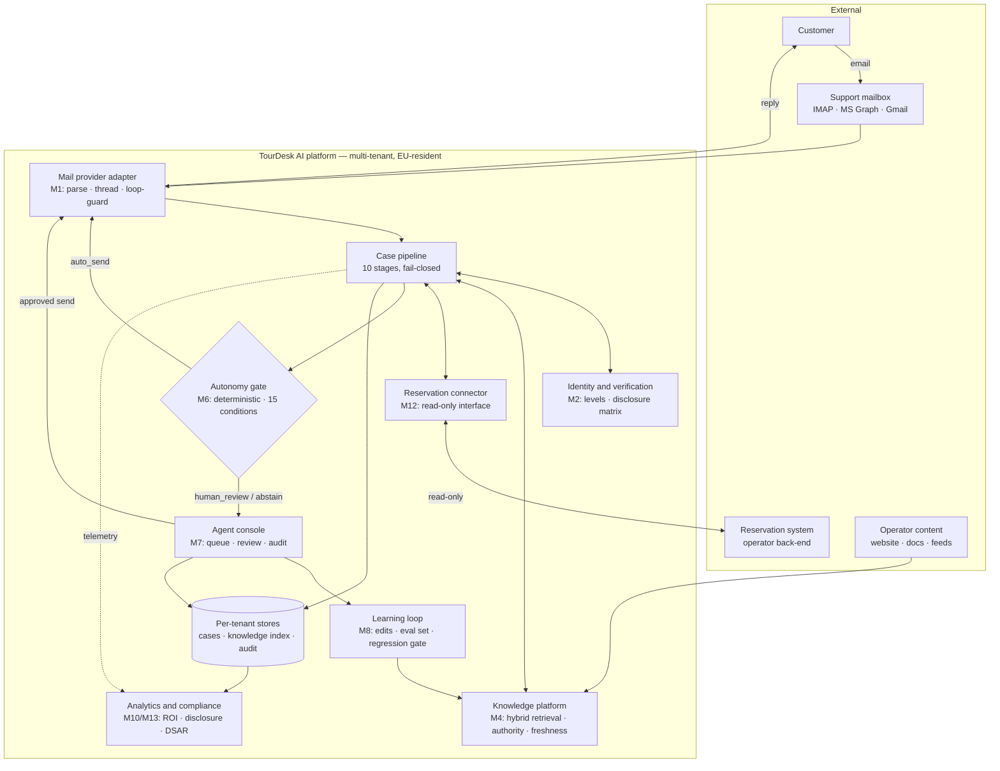
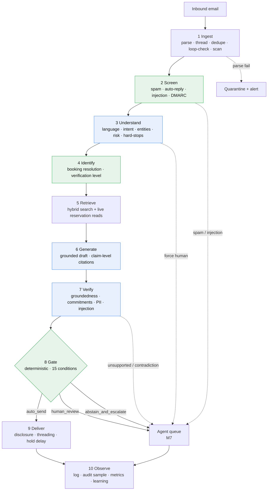
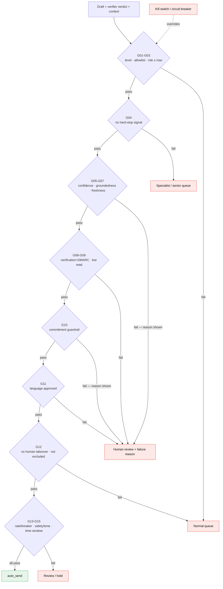
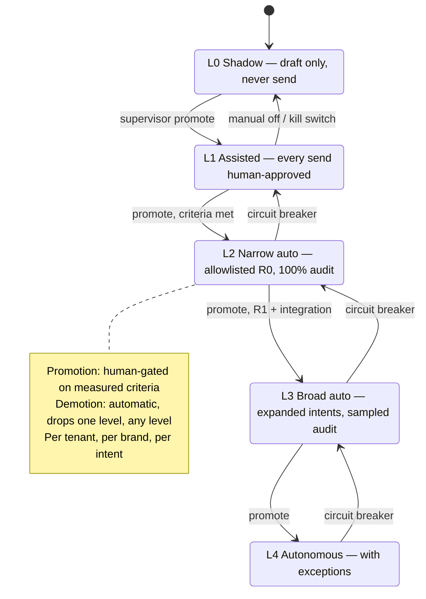
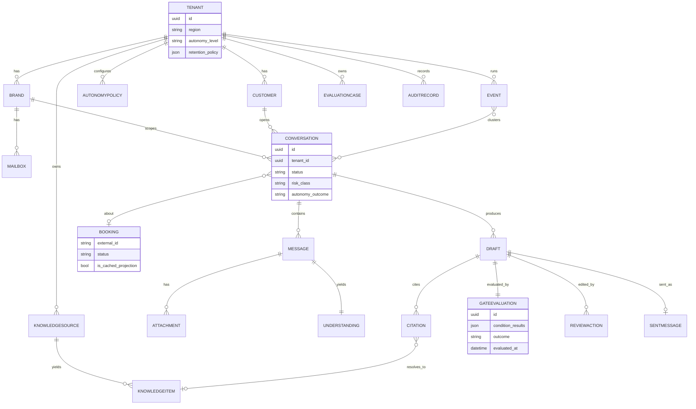

# System Diagrams — TourDesk AI

Derived from the [PRD](../PRD-AI-Support-Desk-for-Tour-Operators.md) and the
[specs](specs/00-overview.md). The Mermaid blocks below render on GitHub and in most Markdown viewers.
Each diagram's source also lives as a standalone `.mmd` file in [`diagrams/`](diagrams/) (with a
pre-rendered `.svg`), validated via Kroki.

| # | Diagram | Source | Governing docs |
|---|---|---|---|
| 1 | System architecture | [`01-system-architecture.mmd`](diagrams/01-system-architecture.mmd) | [overview](specs/00-overview.md) |
| 2 | Case pipeline (10 stages) | [`02-pipeline.mmd`](diagrams/02-pipeline.mmd) | [pipeline](specs/pipeline.md), [ADR-0002](adr/0002-ten-stage-failing-closed-pipeline.md) |
| 3 | Autonomy gate | [`03-autonomy-gate.mmd`](diagrams/03-autonomy-gate.mmd) | [M6](specs/M6-autonomy-gate.md), [ADR-0001](adr/0001-deterministic-send-gate.md) |
| 4 | Trust ladder | [`04-trust-ladder.mmd`](diagrams/04-trust-ladder.mmd) | [M6](specs/M6-autonomy-gate.md), [ADR-0004](adr/0004-trust-ladder-state-machine.md) |
| 5 | Core data model | [`05-data-model.mmd`](diagrams/05-data-model.mmd) | [data-model](specs/data-model.md), [ADR-0015](adr/0015-data-layer-tenant-isolation.md) |

---

## 1. System architecture

The whole platform on one page: customer email arrives at the mailbox, the pipeline enriches it against
the knowledge platform, the reservation connector (read-only) and the identity module, then the
**deterministic gate** decides between auto-send and the human console. Everything is per-tenant isolated
and EU-resident; the learning loop feeds approved answers back into knowledge.



---

## 2. Case pipeline (10 stages)

The spine. Ten discrete, observable stages that each **fail closed** (route to a human or quarantine,
never auto-send). Model calls are confined to the blue stages (3 Understand, 6 Generate, 7 Verify);
the green stages (2 Screen, 4 Identify, **8 Gate**) are deterministic — the send decision is code.



---

## 3. Autonomy gate (stage 8)

Auto-send requires **all 15 conditions (G01–G15) to pass**. Any single failure routes to a human, with
the routing depending on *which* condition failed. A kill switch or circuit breaker overrides everything.



---

## 4. Trust ladder

Autonomy is an explicit per-(tenant, brand, intent) state. **Promotion is human-gated** on measured
criteria — the product proposes, the supervisor disposes. **Demotion is automatic**: the circuit breaker
drops a level from anywhere the moment quality metrics slip.



---

## 5. Core data model

The shared entities (§10). Every entity carries a `tenant_id` and is isolated at the data layer
([ADR-0015](adr/0015-data-layer-tenant-isolation.md)). `Booking` is a short-TTL cached projection, never
the source of truth; per-customer data never enters the shared knowledge index.



---

## Regenerating

The `.mmd` sources are the editable form. To re-validate or re-export after an edit (no local `mmdc`
required — uses the Kroki API):

```bash
cd docs/diagrams
for f in *.mmd; do
  curl -s -X POST -H "Content-Type: text/plain" --data-binary "@$f" \
    https://kroki.io/mermaid/svg -o "${f%.mmd}.svg" && echo "rendered $f"
done
```
